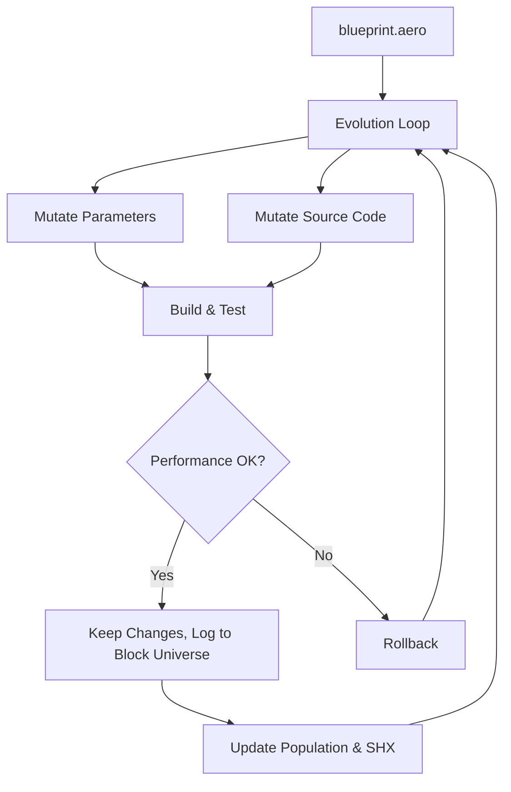

# Aero Future – The Self‑Evolving Compiler Engine

**Aero Future is the next‑generation evolution of AeroNova.**  
It doesn’t just compile code—it **evolves itself** to continuously improve performance, add features, and adapt to new workloads.  

> **The compiler that rewrites itself.**

---

## Overview

Aero Future extends AeroNova’s multi‑objective optimization with a **closed‑loop self‑evolution framework**:

- **Evolves its own source code** and build parameters
- **Learns from its own history** (Block Universe memory)
- **Generates new features** from high‑level specifications
- **Rolls back failed mutations** automatically
- **Runs entirely offline** – no external dependencies

It is a **self‑hosting, self‑mutating, self‑improving** build system.

---

## Core Features

| Feature | Description |
|---------|-------------|
| **Self‑Evolution Loop** | Mutates parameters and source code, rebuilds, tests, and keeps or reverts changes based on performance. |
| **Block Universe History** | All past builds and mutations are stored as an immutable, queryable ledger (`context.aero`). |
| **Feature Generation** | New modules (e.g., causal inference, EHEL) are created from blueprint specs and then evolved. |
| **Source Mutation** | Mutates Python source files using AST‑based rewrites (insert functions, add imports, add docstrings). |
| **Causal Inference** | Estimates which parameters have the greatest impact on performance to bias mutations. |
| **SHX Crossover** | Recombines successful historical configurations to generate better offspring. |
| **VP Tree Similarity** | Avoids duplicate parameter searches by measuring similarity to past configurations. |
| **Self‑Hosting** | Can compile and test itself, enabling bootstrapping and continuous evolution. |
| **Zero Dependencies** | Uses only Python standard library + Tree‑sitter (and optional scipy/sklearn for advanced features). |

---

## How It Works



The **evolution loop** runs repeatedly:

1. **Reads** the current `self_host.aero` blueprint.
2. **Generates** missing features from specs.
3. **Mutates** build parameters and/or source files.
4. **Rebuilds** the compiler (`main.py build`).
5. **Measures** performance (speed gain, size reduction, execution time).
6. **Logs** metrics to `context.aero`.
7. **Rolls back** on regression.
8. **Repeats** – each generation improves the system.

---

## Getting Started

### Prerequisites

- Python 3.10+
- Tree‑sitter runtime (for parsing)
- Optional: scikit‑learn, scipy (for causal inference and MTBO)

### Installation

```bash
git clone https://github.com/sys1own/aero-future.git
cd aero-future
pip install -e .
```

### Quick Start

1. **Run a self‑evolution cycle** (5 generations, population 8):
   ```bash
   python evolve.py . 5 8
   ```

2. **Check the evolution history**:
   ```bash
   cat context.aero | jq '.mutation_history[] | {gen: .generation, speed_gain: .metrics.speed_gain}'
   ```

3. **See what source mutations were applied**:
   ```bash
   git diff
   ```

---

## Configuration

### `self_host.aero` – The Evolution Blueprint

The evolution loop is driven by a TOML‑based blueprint. Key sections:

```toml
[workspace]
root = "."
build_dir = ".aero/bootstrap_stage"

[source_mutation]
enabled = true
mutation_rate = 0.8
target_files = ["*.py", "builder_brains/*.py"]
rules = ["insert_function_stub", "insert_import", "add_docstring"]

[features]
[features.causal_inference]
enabled = true
[features.ehel]
enabled = true
[features.multi_task_bo]
enabled = true

[cortex]
target_accuracy_floor = 0.9990
cycles = 10

[cortex.nsga2]
population_size = 20
mutation_rate = 0.15
crossover_rate = 0.80

[self_host]
bootstrap_stage = 1
atomic_swap_directory = "bin/aero_engine"
```

### Adding New Features

To add a new feature, simply add a section to `self_host.aero`:

```toml
[features.my_new_feature]
enabled = true
```

The `FeatureGenerator` will create a stub module in `builder_brains/` on the next run.

---

## CLI Commands

| Command | Purpose |
|---------|---------|
| `python evolve.py <workspace> <generations> <population>` | Run the self‑evolution loop. |
| `python main.py build` | Standard build (used inside the loop). |
| `python main.py plan` | Visualise the build DAG. |
| `python main.py heal --path <file>` | Run the self‑healing repair on a single file. |
| `python main.py commit-overlay <file>` | Save manual edits to survive regeneration. |

---

## Architecture Highlights

- **Block Universe Ledger** (`context.aero`): Append‑only JSON log of all mutations, metrics, and outcomes.
- **Source Mutator**: Uses Python’s `ast` module to rewrite code safely.
- **Feature Generator**: Creates new modules from templates based on blueprint specs.
- **SHX (Search History Driven Crossover)**: Recombines successful historical configurations.
- **VP Tree**: For fast similarity search in parameter space.
- **Causal Inference**: Correlates parameters with performance to guide mutation rates.

---

## Contributing

Aero Future is itself an evolving system. Contributions are welcome:

1. Fork the repository.
2. Add a new feature spec to `self_host.aero`.
3. Run the evolution loop to let the system generate and refine the code.
4. Submit a pull request with the new spec and the evolved code.

---

## License

This project is open‑source software distributed under the terms of the **MIT License**.

---

## Acknowledgements

- Built on the foundation of [AeroNova](https://github.com/sys1own/aero-nova).
- Inspired by evolutionary algorithms, genetic programming, and self‑healing systems.

---

**Aero Future – The living compiler.**
```
